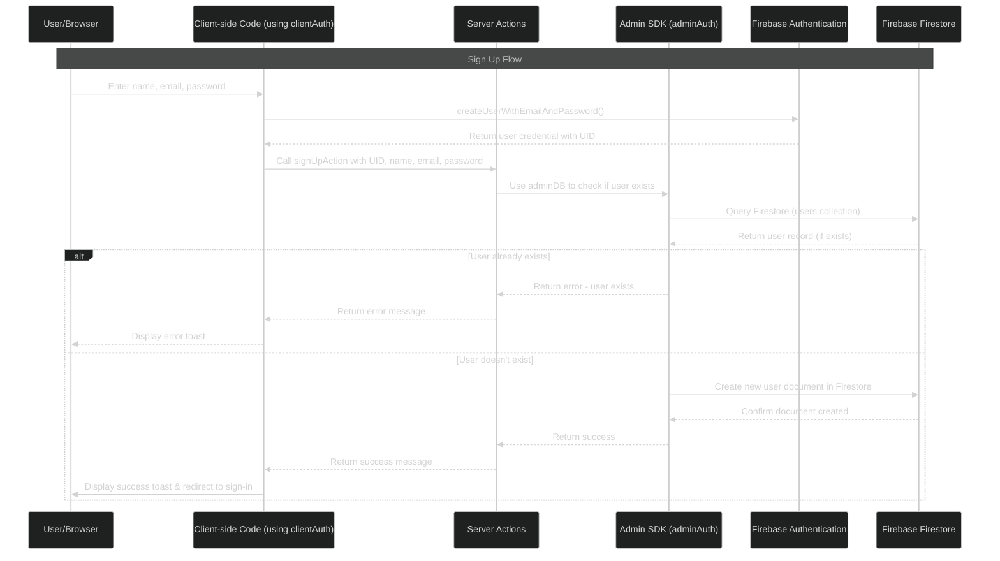
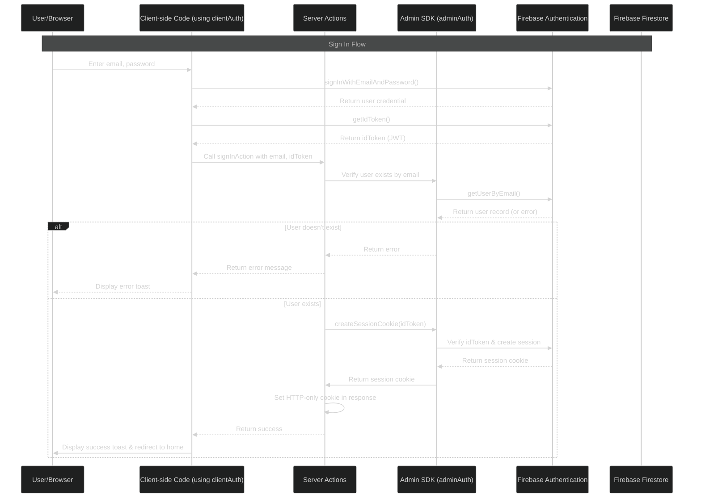
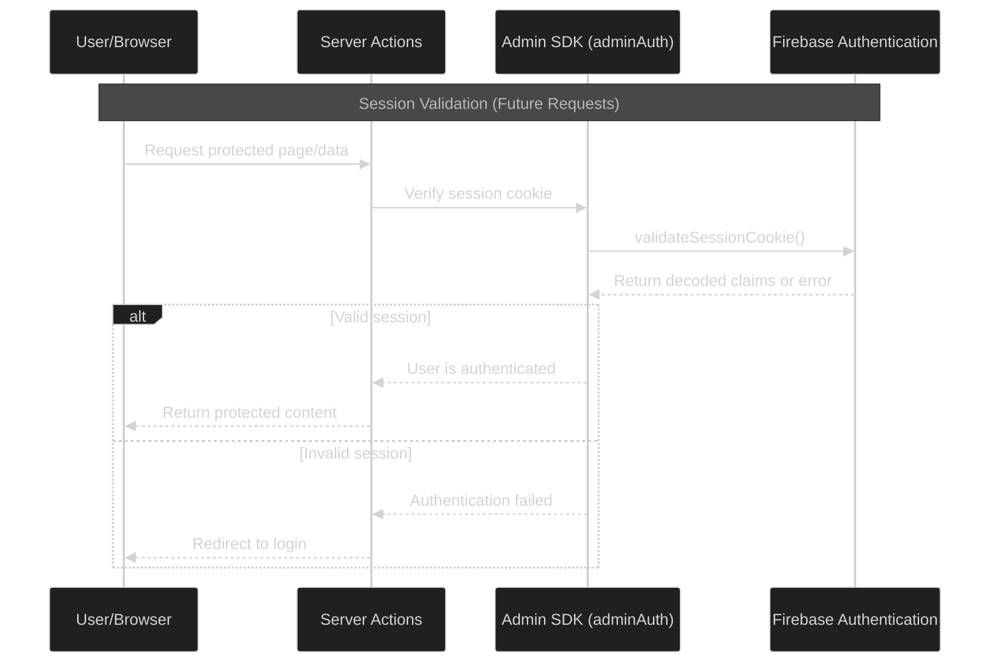

# VoxNavi

<div align="center">


<h2>AI-Powered Interview Preparation Platform</h2>

<p>
VoxNavi is a modern, responsive web application designed to help job seekers prepare for interviews through AI-powered mock interviews and detailed feedback.
</p>

</div>

<div align="center">

[](https://opensource.org/licenses/Apache-2.0)
[](https://nextjs.org/)
[](https://firebase.google.com/)
[](https://www.typescriptlang.org/)

</div>

## 🔗 Live Demo

Experience VoxNavi in action: [https://vox-navi.vercel.app/](https://vox-navi.vercel.app/)

## 📱 Desktop View


## ✨ Features

- **AI Voice Interviews**: Practice with Vapi's voice assistant for a realistic interview experience
- **Customizable Interviews**: Generate interviews tailored to specific job roles, experience levels, and tech stacks
- **Comprehensive Feedback**: Get detailed assessments powered by Google's Gemini AI
- **User Authentication**: Secure signup and login system via Firebase Authentication
- **Interview Library**: Access and attempt interviews created by other users
- **Dark Mode Design**: Modern, sleek UI with responsive design for all devices
- **Detailed Performance Analytics**: View scores across multiple categories including communication skills, technical knowledge, and problem-solving
- **Privacy Control**: Option to delete all user data upon account deletion

## 🛠️ Tech Stack

- **Frontend**: Next.js 15, React 19, Tailwind CSS 4
- **UI Components**: shadcn/ui
- **Backend**: Next.js API Routes, Firebase Admin SDK
- **Database**: Firebase Firestore
- **Authentication**: Firebase Auth
- **Form Validation**: Zod, React Hook Form
- **AI Services**:
  - Voice Assistant: Vapi AI
  - Feedback Generation: Google Gemini
  - Interview Questions: OpenAI
- **Deployment**: Vercel

## 🚀 Getting Started

### Prerequisites

- Node.js 18+
- npm or yarn
- Firebase account

### Installation

1. Clone the repository

```bash
git clone https://github.com/KeepSerene/vox-navi-ai-interview-prep-next-app
cd vox-navi-ai-interview-prep-next-app
```

2. Install dependencies

```bash
npm install
# or
yarn install
```

3. Set up environment variables
   Create a `.env.local` file with the following variables:

```
# Firebase
NEXT_PUBLIC_FIREBASE_API_KEY=
NEXT_PUBLIC_FIREBASE_AUTH_DOMAIN=
NEXT_PUBLIC_FIREBASE_PROJECT_ID=
NEXT_PUBLIC_FIREBASE_STORAGE_BUCKET=
NEXT_PUBLIC_FIREBASE_MESSAGING_SENDER_ID=
NEXT_PUBLIC_FIREBASE_APP_ID=

# Firebase Admin (Service Account)
FIREBASE_ADMIN_PROJECT_ID=
FIREBASE_ADMIN_CLIENT_EMAIL=
FIREBASE_ADMIN_PRIVATE_KEY=

# Google AI SDK
GOOGLE_API_KEY=

# Vapi
NEXT_PUBLIC_VAPI_API_KEY=
```

4. Run the development server

```bash
npm run dev
# or
yarn dev
```

5. Open [http://localhost:3000](http://localhost:3000) in your browser to see the application

## 📚 Project Structure

```
vox-navi-next15-app/
├── app/                  # Next.js pages and API routes
├── components/           # Reusable React components
├── constants/            # Application constants
├── firebase/             # Firebase configuration and utils
├── lib/                  # Utility functions and hooks
├── public/               # Static assets
├── types/                # TypeScript type definitions
└── ...config files
```

## 🔒 Authentication Flow

VoxNavi uses Firebase Authentication with secure session cookies for enhanced security:

- Server-side session validation
- HTTP-only cookies
- Session expiration and automatic renewal

## User Authentication using Firebase Auth


### Sign Up Flow



### Sign In Flow



### Session Validation Flow (Future Requests)



## Detailed Auth Explanations

### Sign Up Process:

1. User enters their information in the AuthForm component
2. Client-side Firebase creates the auth record via `createUserWithEmailAndPassword`
3. You get a user credential with a UID from Firebase Authentication
4. The server action `signUpAction` then stores additional user information in Firestore
5. If successful, user is redirected to sign in

### Sign In Process:

1. User enters email/password in the AuthForm
2. Client-side Firebase authenticates via `signInWithEmailAndPassword`
3. You request an ID token (JWT) from the authenticated user
4. The server action `signInAction` verifies the user and creates a session cookie
5. This cookie is set in the HTTP response as an HTTP-only cookie
6. Future requests will include this cookie automatically, authenticating the user

### What is the ID Token (`idToken`)?

The ID token is a JWT (JSON Web Token) that:

- Is created by Firebase when a user authenticates
- Contains the user's identity information
- Is cryptographically signed to verify authenticity
- Is short-lived (usually 1 hour)
- Gets exchanged on the server for a longer-lived session cookie

## 📊 Interview and Feedback System

1. **Interview Generation**:

   - Custom interviews based on job role, experience level, and tech stack
   - Questions generated using AI models

2. **Voice Interview Process**:

   - Real-time voice interaction with the AI assistant
   - Transcript recording for feedback generation

3. **Feedback Analysis**:
   - Multiple performance categories assessment
   - Strengths and areas for improvement
   - Overall score and detailed recommendations

## 🤝 Contributing

Contributions are welcome! Please feel free to submit a Pull Request.

1. Fork the repository
2. Create your feature branch (`git checkout -b feature/amazing-feature`)
3. Commit your changes (`git commit -m 'Add some amazing feature'`)
4. Push to the branch (`git push origin feature/amazing-feature`)
5. Open a Pull Request

## 📝 License

This project is licensed under the Apache License 2.0 - see the [LICENSE](LICENSE) file for details.

## 👨‍💻 Author

Lead developer: [Dhrubajyoti Bhattacharjee](https://github.com/KeepSerene)

## 🙏 Acknowledgements

- [Next.js](https://nextjs.org/)
- [Firebase](https://firebase.google.com/)
- [Vapi AI](https://vapi.ai/)
- [Google Gemini](https://ai.google.dev/)
- [shadcn/ui](https://ui.shadcn.com/)
- [Tailwind CSS](https://tailwindcss.com/)
- [Vercel](https://vercel.com/)
